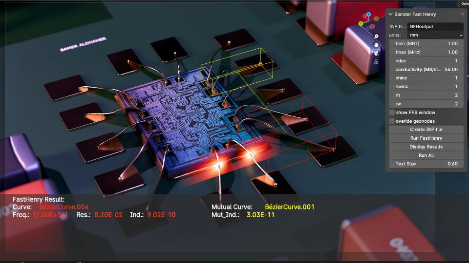
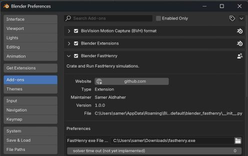
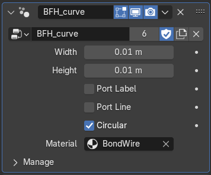
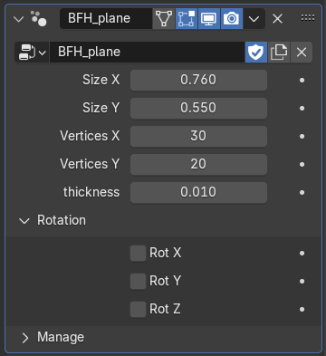
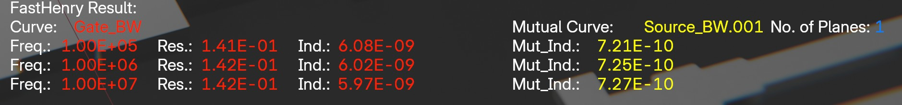
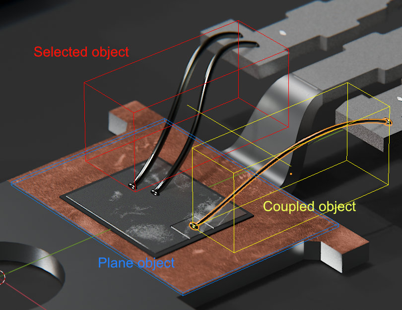
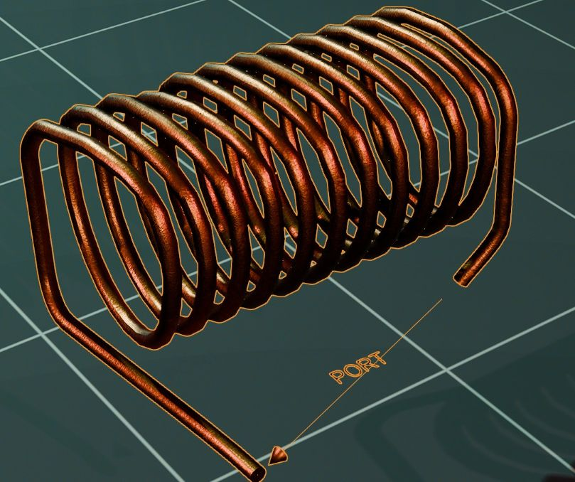
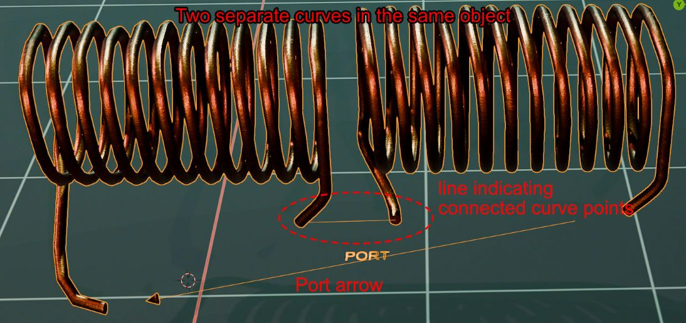
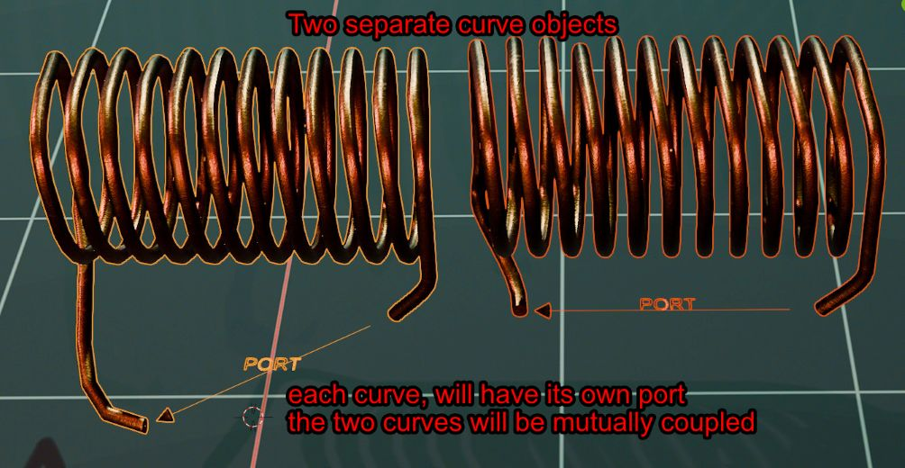

# Blender FastHenry    

**Samer Aldhaher @samerps 2024**

Blender FastHenry is a Blender 4.2 extension for creating FastHenry simulations. You can model geometries (curves) and planes, and call FastHenry executable to solve for resistance, inductance and mutual inductance. The results are displayed visually in Blender.

This extension uses geometry nodes to set some parameters, such as segment width and thickness. It also uses geometry nodes to visualize ports and connecting nodes between separate curve objects. 

## Contents
1. [Installation instructions](#installation-instructions---windows)
1. [Quick start guide](#quick-start-guide)
    - [Simulation set-up](#simulation-set-up)
    - [Visualizing results](#visualizing-results)
1. [Extension capabilities](#3-extension-capabilities)
    - [Ports](#ports)
    - [Connected and mutually-coupled objects](#connected-and-mutually-coupled-objects)
    - [Planes](#planes) 
    - [Electromag nodes integration](#electromag-nodes-integration)
1. [Limitations](#4-limitations)
1. [To do](#5-to-do)
1. [Applications and use-cases](#6-applications-and-use-cases)
1. [Future](#7-future)

## 1. Installation Instructions - Windows 
- only compatible with **Blender 4.2** and above
- download extension archive package
- compile/download `fasthenry.exe` executable from [FastHenry-Sam](https://github.com/samerps/FastHenry2-Sam)
- drag and drop archive in Blender
- enable extension, go to addon preferences and set path for `fasthenry.exe` 
- Blender FastHenry should now be available in the N panel

*MacOS and Linux versions coming soon*

 

## 2. Quick Start Guide

### Simulation set-up
- watch YouTube quick start video (coming soon)
- use included predefined Geometry Node Groups for curve objects and planes
- move all **curves** required to be solved in a separate **Curves** collection
- move all **planes** required to be solved in a separate **Planes** collection
- set simulation parameters in N panel and set the curves and panels collections 
- run simulation
- any objects that do not have the right properties (ex. object type, geometry node group) will be automatically moved to a new collection named **rejected**

### Visualizing results  
- results are overlaid in the view port. Each row represents the impedance at a certain frequency of a single object along with a mutually coupled object

- use **up/down keyboard arrow** keys to scroll through all simulation objects, the impedance results will be updated based on the object selected. A **red** bounding box is drawn around the selected object

- use the **left/right keyboard** arrow keys to scroll through all the mutually coupled objects for the current set. A **yellow** bounding box is drawn around the set mutually coupled object. 
- **blue** bounding boxes are drawn around each plane object

## 3. Extension Capabilities 
### Ports
- ports are automatically assigned between the first curve point and the last curve point of each curve object 
- port arrow and text visibility can be controlled in the geometry node modifier panel

### Connected and mutually-coupled objects

- Separate curves within the same curve object will be considered as a single coil, the end point of each individual will be automatically  connected to the start point of the next curve. This connection will be automatically visually displayed as a single solid line. 

- Multiple curve objects will considered as mutually coupled. 

### Planes
- plane objects can only be parallel to the xy, xz, or yz planes, no arbitrary rotation allowed. 

### Electromag Nodes integration
- Combine with [ElectroMag Nodes](https://blendermarket.com/products/electromag-nodes) to visualize magnetic fields.

## 4. Limitations

### FastHenry limitations
As this extension uses FastHenry, it is bound by the same limitations of FastHenry itself, specifically:
- cannot model material permeability, only conductors.
- FastHenry is not field solver, it will not calculate the magnetic field.
- rectangular cross sections only, though width and thickness can be changed per segment.
- plane objects can only be in xy, xz and yz planes, no arbitrary rotations allowed, this is a limitation of FastHenry.

### Extension limitations

- all segments within a curve will have same the width and thickness. This is in the To Do list to change
- plane holes cannot be modelled. This is in the To Do list to change.
- connect curve segments to planes. This is in the To Do list to change.
- currently only one segment can connect to another. i.e. each node can only connect to two segments. This is in the To Do list to change.    

## 5. To Do
- [ ] ability to change the length and width for each segment within a curve. 
- [ ] specify holes in planes. 
- [ ] connect curves to planes.
- [ ] connect multiple segments to nodes.

## 6. Applications and Use Cases
- Semiconductor wire bonds and copper clip impedance extraction
- PCB layout impedance extraction
- RF Air core impedance calculation
- Core-less transformers
- Cables and wiring impedance calculation
- Bus bar impedance calculation
- Wireless power transfer coils modelling and coupling coefficient calculation  
- Induction heating coil design

## 7. Future

The source code of FastHenry is based on outdated C code and obsolete libraries. Fasthenry uses the Sparse 1.3 ( Kenneth S. Kundert) library which dates back to 1988.

My plan is to create a new solver based on the theoretical concepts of FastHenry using modern code and libraries, and to address some of its limitations. 
